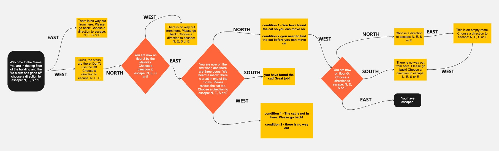
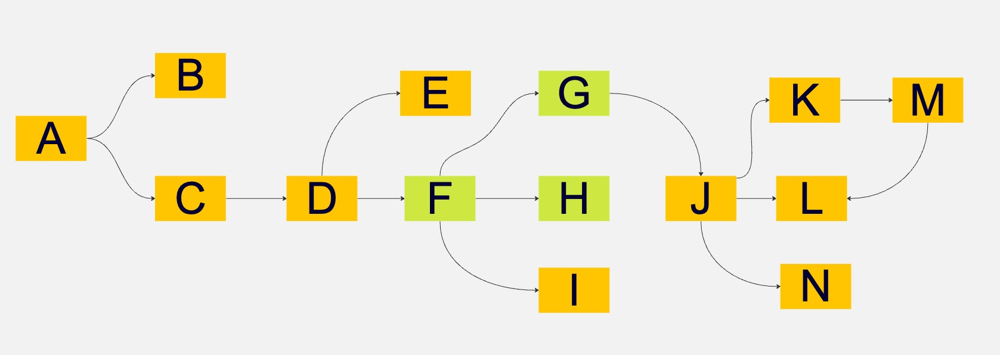

# Adventure Game Project

## Project Brief

Welcome to the Adventure Game project! In this project, we aim to create a basic text-based game reminiscent of the classic Adventure game. Users will navigate through different rooms by providing input, and the program will respond with descriptions of each room.

## Project Overview

1. **User Movement:** Establish a system for users to navigate through the game by specifying directions (e.g., north, south, east, west).

2. **Position Tracking:** Implement a mechanism to keep track of the user's current position within the game world. This is crucial for determining which room the user is in and managing their progress.

3. **Room Descriptions:** Create detailed descriptions for each room in the game. When the user enters a room, the program should provide them with a description of their surroundings.

4. **Movement Limits:** Define limits for user movement to create a boundary within the game world. Users should be informed when attempting to move beyond these limits, simulating "walls" that restrict further movement in a particular direction.

Game Flow




## Getting Started

Follow these steps to set up and run the game:

1. **Run The Program:**
   ```
   python game.py
   ```

## Contribution

Contributions are welcome! If you have ideas for improvements, new features, or bug fixes, feel free to open an issue or submit a pull request.

Let's embark on this coding adventure together! 🚀
